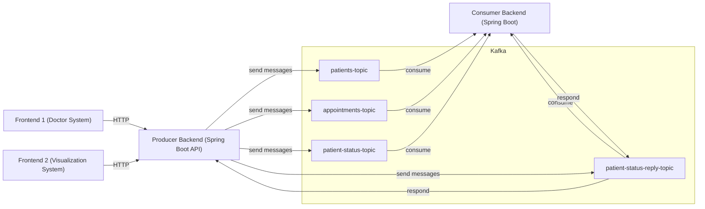

# TC3005B Sprint2 Kafka Example

## Execution

Run backend with.

```bash
# First install kafka with ./install_kafka.sh
./run.sh
```

Stop frontend with.

```bash
./stop.sh
```

Run frontends with.

```bash
cd admin_frontend && npm run dev
cd visual_frontend && npm run dev
```

# Architecture Diagram


